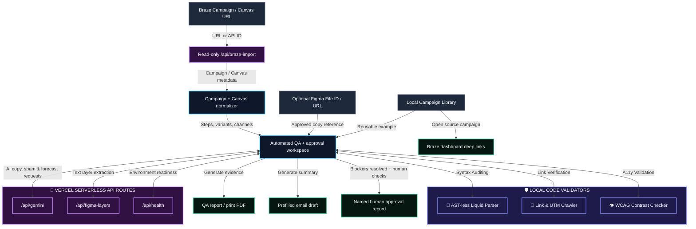
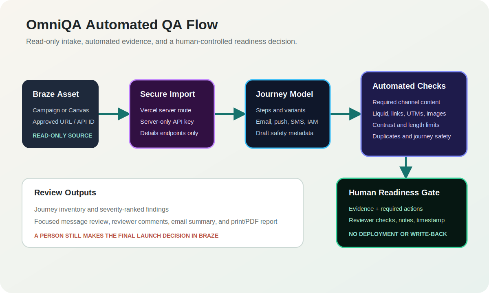

# OmniQA for Braze 🍦

OmniQA is a read-only pre-deployment QA workspace for Braze Campaigns and Canvases. It can import an approved Braze asset, normalize every available step and message variant, run deterministic campaign and journey checks, produce evidence-based reports, and record a named human readiness decision. It cannot deploy, activate, or modify a Braze asset.


---

## 🛠️ System Architecture & Data Flow





### Component Breakdown & Data Flow
1.  **Read-only Braze intake**: `/api/braze-import` accepts a Campaign or Canvas URL/ID and calls only the Braze details export endpoint selected for that asset type.
2.  **Multistage normalization**: The client converts Campaign messages and Canvas steps into one stable model containing steps, message variants, channels, content, and configuration.
3.  **Deterministic QA**: Local validators check Liquid pairing, required content, channel limits, sender configuration, links, UTMs, image accessibility, contrast, duplicate content, conversion metadata, and draft safety.
4.  **Focused review**: Any imported message can be opened in the existing copy and technical review tools for detailed inspection or repair planning.
5.  **Human approval gate**: Blockers disable approval. A named reviewer must complete business-logic, content, personalization, and test-evidence confirmations before OmniQA records readiness.
6.  **Safety boundary**: There is no Braze deployment, activation, scheduling, or write-back route.

---

## 🚀 Key Features

### 1. Automated QA
*   **Campaign and Canvas Import**: Accepts a Braze URL or API identifier and can include the post-launch draft when available.
*   **Full Journey Inventory**: Lists every imported step, message variant, and channel with its finding count.
*   **Automatic Evidence**: Produces severity, evidence, and required remediation for each deterministic finding.
*   **Human-Controlled Approval**: Prevents approval while blockers remain and stores the named reviewer, confirmations, decision note, and timestamp locally.

### 2. Overview & Reporting
*   **Journey Health Overview**: Shows the latest multistage score, status, steps, messages, channels, and open findings.
*   **Email Report Draft**: Opens a prefilled email with the current QA summary and issue list.
*   **PDF Export**: Uses the browser print flow to save or print a campaign QA report.

### 3. Focused QA Review
*   **Message-Level Handoff**: Opens any imported email, push, SMS, or IAM message in the focused review tools with its current content loaded.
*   **Automatic Sandbox Checks**: Re-runs local and simulated checks as focused message content changes.
*   **Multiple Copy Sources**: Supports read-only Braze import, local Library examples, direct editing, and configured Figma text extraction.
*   **Figma Layer Cross-Checking**: Compares text nodes extracted from Figma designs directly with Braze HTML templates and subject lines.
*   **Fuzzy Text-Diff Matcher**: Dynamically tokenizes and scans plain text inside HTML tags to match lines of Figma design copy on the fly.
*   **Monaco HTML Code Editor**: Embeds a rich, syntax-highlighted editor with line numbers, code folding, word wrap, and automatic layout resizing that compiles state changes in real time.
*   **Liquid Logic Delimiter Checker**: Scans logic control flows (`` and `{{ ... }}`) for nesting depth errors, missing delimiters, or orphaned statements.
*   **UTM Link Crawler**: Crawls all anchor links to detect dead hrefs, placeholder domains, and missing marketing UTM analytics keys.
*   **HTML Contrast Auto-Fixer**: Features a one-click repair engine that automatically adjusts violating button contrasts, resolves empty placeholder links, and appends missing UTM trackers.

### 4. Campaign Library and Configuration
*   **Local Campaign Library**: Tracks reusable campaign examples, versions, and status for repeat QA.
*   **Cluster-Mapped Workspace Links**: Maps REST API endpoints (e.g. `rest.iad-01`, `rest.iad-03`, `rest.eu`) to direct, clickable URLs pointing straight to your campaign configuration inside the Braze dashboard console.

---

## 💻 Tech Stack & Design

*   **Core**: React, Vite, and CSS variables.
*   **Theme**: Compact dark interface with clear hierarchy, restrained status color, and responsive navigation.
*   **Typography**: Outfitted with *Outfit* for modern SaaS headers and *JetBrains Mono* for responsive code blocks.

---

## ⚙️ Quick Start & Installation

### Local Sandbox Run (Offline Simulator)
By default, the app initializes in **Sandbox Demo mode**. This allows you to explore the dashboard immediately using high-fidelity test campaigns and simulated responses without setting up API keys.

1.  Navigate to the directory:
    ```bash
    cd omni-qa-braze
    ```
2.  Install dependencies:
    ```bash
    npm install
    ```
3.  Launch the local dev environment:
    ```bash
    npm run dev
    ```
4.  Open `http://localhost:5176` (or the port Vite allocates) in your browser.

### Live Production Configuration
OmniQA now supports a secure live-mode MVP through Vercel Serverless Functions. Browser users do **not** paste long-lived API secrets into the app; the frontend calls internal routes and the routes read environment variables on the server.

1.  In Vercel, add these environment variables:
    *   `BRAZE_REST_API_KEY` - required for live read-only import. Use a key limited to `campaigns.details` and `canvas.details` permissions.
    *   `BRAZE_REST_ENDPOINT` - required Braze REST base URL for your workspace, such as `https://rest.iad-05.braze.com`.
    *   `GEMINI_API_KEY` - required for live AI copy, spam, and engagement audits.
    *   `FIGMA_ACCESS_TOKEN` - optional; required only for live Figma text-layer extraction.
    *   `GEMINI_MODEL` - optional, defaults to `gemini-1.5-flash`.
2.  Redeploy the project after saving environment variables.
3.  Go to the **Settings** panel in OmniQA.
4.  Toggle off **Use Sandbox Simulation / Demo Mode**.
5.  Use **Run Diagnostics Handshake** to confirm the Braze, AI, and optional Figma routes are configured.
6.  Open **Automated QA**, paste an approved Campaign or Canvas URL, and import it for review.

Live mode currently supports:
*   Read-only Braze Campaign and Canvas import through `/api/braze-import`.
*   Server-side Gemini copy, deliverability, and engagement analysis through `/api/gemini`.
*   Server-side Figma text extraction through `/api/figma-layers`.
*   Local Liquid, link, image, UTM, and WCAG-style validators in the browser.
*   Braze dashboard deep-linking from the campaign catalog.

Reserved for a later production phase:
*   Authenticated user accounts and server-side audit history.
*   Server-side PDF/report storage and email delivery.
*   Organization SSO and role-based access controls.

OmniQA intentionally does not include Braze write-back or deployment automation.
