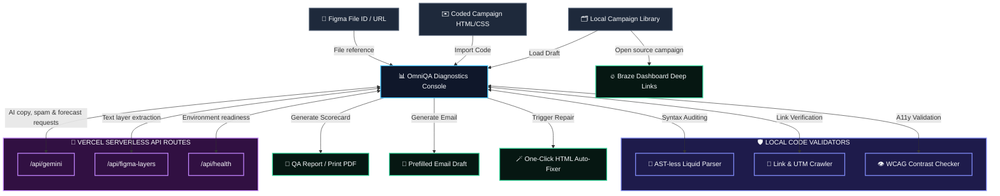

# OmniQA for Braze 🍦

OmniQA is a focused diagnostic workspace for CRM engineering, campaign managers, and marketing developers. It reviews one active campaign message at a time, combining campaign intake, copy comparison, code checks, launch checkpoints, and report-ready results before a Braze send.


---

## 🛠️ System Architecture & Data Flow



### Component Breakdown & Data Flow
1.  **Input Sources**: Active-message content comes from pasted or edited HTML/copy, local Library entries, and Figma file IDs or URLs. OmniQA does not currently import message bodies from Braze.
2.  **OmniQA Core Controller (`App.jsx`)**: Orchestrates shared campaign data across Overview, Campaign Checklist, QA Review, Library, and Settings.
3.  **Campaign Checklist**: Combines compact campaign setup, editable campaign types, reusable templates, checkpoints, comments, and reviewer notes in one ordered workflow. A multistage Canvas is reviewed message by message.
4.  **Local Validators**: Processes Liquid syntax, URL/UTM patterns, contrast checks, image risks, and preview states locally for instant feedback.
5.  **Secure Server Routes**: Calls `/api/gemini`, `/api/figma-layers`, and `/api/health` so Gemini and Figma secrets stay in Vercel environment variables instead of browser storage.
6.  **Output Layer**: Supports launch-readiness review, editable checklist notes, HTML repair helpers, and Braze dashboard deep links. Braze REST write-back is reserved for a later production phase.

---

## 🚀 Key Features

### 1. Overview & Reporting
*   **Campaign Health Overview**: Shows active-message scores, issue severity, channel readiness, and engagement forecast in one starting view.
*   **Email Report Draft**: Opens a prefilled email with the current QA summary and issue list.
*   **PDF Export**: Uses the browser print flow to save or print a campaign QA report.

### 2. Campaign Checklist
*   **Structured Campaign Intake**: Captures campaign or Canvas name, type, launch date, audience/segment, offer logic, required variables, and reviewer notes.
*   **Editable Campaign Types**: Keeps built-in templates while allowing reviewers to add, select, and remove custom campaign types.
*   **Reusable Templates**: Applies starter channel copy for birthday, onboarding, promotional loyalty, and winback workflows.
*   **Editable Checkpoints**: Lets reviewers add, remove, reorder through edits, and complete campaign-specific checks.
*   **Checkpoint Notes**: Stores a note, blocker, owner, or follow-up directly with each checkpoint.

### 3. Focused QA Review
*   **Active-Message Scope**: Reviews one email, push, SMS, or IAM state at a time. For a multistage Canvas, save or load each message separately and run QA for every step.
*   **Automatic Sandbox Checks**: Re-runs local and simulated checks as active-message content changes. Live mode runs when the reviewer selects **Run QA**.
*   **Manual or Library Copy Intake**: Loads copy from local Library examples, direct editing/paste, or configured Figma text extraction. Braze links are navigation shortcuts, not content imports.
*   **Figma Layer Cross-Checking**: Compares text nodes extracted from Figma designs directly with Braze HTML templates and subject lines.
*   **Fuzzy Text-Diff Matcher**: Dynamically tokenizes and scans plain text inside HTML tags to match lines of Figma design copy on the fly.
*   **Monaco HTML Code Editor**: Embeds a rich, syntax-highlighted editor with line numbers, code folding, word wrap, and automatic layout resizing that compiles state changes in real time.
*   **Liquid Logic Delimiter Checker**: Scans logic control flows (`` and `{{ ... }}`) for nesting depth errors, missing delimiters, or orphaned statements.
*   **UTM Link Crawler**: Crawls all anchor links to detect dead hrefs, placeholder domains, and missing marketing UTM analytics keys.
*   **HTML Contrast Auto-Fixer**: Features a one-click repair engine that automatically adjusts violating button contrasts, resolves empty placeholder links, and appends missing UTM trackers.

### 4. Campaign Library
*   **Local Campaign Library**: Tracks reusable campaign examples, versions, and status for repeat QA.
*   **Cluster-Mapped Workspace Links**: Maps REST API endpoints (e.g. `rest.iad-01`, `rest.iad-03`, `rest.eu`) to direct, clickable URLs pointing straight to your campaign configuration inside the Braze dashboard console.

---

## 💻 Tech Stack & Design

*   **Core**: React, Vite, and CSS variables.
*   **Theme**: Compact dark interface with clear hierarchy, restrained status color, and responsive navigation.
*   **Typography**: Outfitted with *Outfit* for modern SaaS headers and *JetBrains Mono* for responsive code blocks.

---

## ⚙️ Quick Start & Installation

### Local Sandbox Run (Offline Simulator)
By default, the app initializes in **Sandbox Demo mode**. This allows you to explore the dashboard immediately using high-fidelity test campaigns and simulated responses without setting up API keys.

1.  Navigate to the directory:
    ```bash
    cd omni-qa-braze
    ```
2.  Install dependencies:
    ```bash
    npm install
    ```
3.  Launch the local dev environment:
    ```bash
    npm run dev
    ```
4.  Open `http://localhost:5176` (or the port Vite allocates) in your browser.

### Live Production Configuration
OmniQA now supports a secure live-mode MVP through Vercel Serverless Functions. Browser users do **not** paste long-lived API secrets into the app; the frontend calls internal routes and the routes read environment variables on the server.

1.  In Vercel, add these environment variables:
    *   `GEMINI_API_KEY` - required for live AI copy, spam, and engagement audits.
    *   `FIGMA_ACCESS_TOKEN` - required for live Figma text-layer extraction.
    *   `GEMINI_MODEL` - optional, defaults to `gemini-1.5-flash`.
2.  Redeploy the project after saving environment variables.
3.  Go to the **Settings** panel in OmniQA.
4.  Toggle off **Use Sandbox Simulation / Demo Mode**.
5.  Add a Figma file ID or URL and save the configuration.
6.  Use **Run Diagnostics Handshake** to confirm the server routes are configured.

Live mode currently supports:
*   Server-side Gemini copy, deliverability, and engagement analysis through `/api/gemini`.
*   Server-side Figma text extraction through `/api/figma-layers`.
*   Local Liquid, link, image, UTM, and WCAG-style validators in the browser.
*   Braze dashboard deep-linking from the campaign catalog.

Reserved for a later production phase:
*   Braze REST read/write sync.
*   Canvas-level aggregation that combines several message audits into one journey report.
*   Authenticated user accounts and server-side audit history.
*   Server-side PDF/report storage and email delivery.
