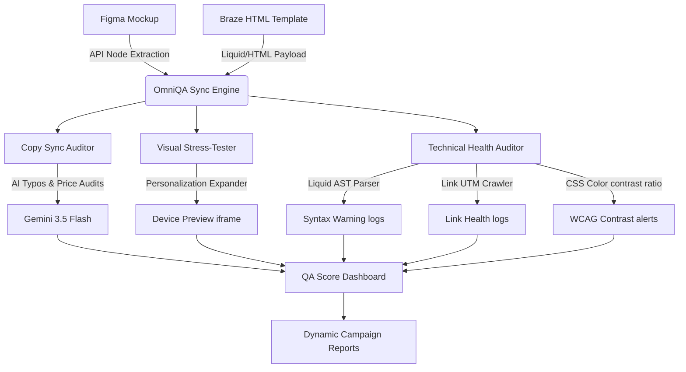

# OmniQA for Braze 🍦

OmniQA is a unified, real-time diagnostic dashboard designed for CRM engineering, campaign managers, and marketing developers. It automates campaign quality assurance by validating coding structures, verifying design compliance, and predicting deliverability health before you hit "Send" in Braze.


---

## 🛠️ System Architecture & Data Flow



---

## 🚀 Key Features

### 1. Copy & Contrast Sync Auditor
*   **Figma Layer Cross-Checking**: Compares text nodes extracted from Figma design layout directly with Braze HTML code and Subject Line.
*   **Fuzzy Text-Diff Matcher**: Dynamically crawls plain text in the HTML body to match lines of Figma copy on the fly.
*   **Typographical Punctuation (Marks) QA**: Scans for spacing inconsistencies (like double spaces `  `), capitalization casing differences, and duplicate punctuation marks (consecutive `,,` or `!!`).
*   **Unified Access Dials**: Integrates HTML color contrast and Dark Mode risk warnings directly into the Copy Auditor discrepancies log.
*   **Debounced Auto-Auditor**: Triggers the validator automatically after a 150ms pause as you type (only in Sandbox Demo mode), updating scorecards instantly.

### 2. Multi-Device Layout Visual Stress-Tester
*   **Preset Device Layouts**: Instantly preview rendering layout on **iPhone (iOS)**, **Android**, **Tablet**, and **Laptop** device frame presets.
*   **Email Dark Mode Simulator**: Toggle client inversion simulation (☀️ Light / 🌙 Dark) next to the device frame. In Dark Mode, a simulator stylesheet is injected dynamically to override card backings, table structures, and headings, verifying text readability.
*   **Theme-Adaptive Figma Spec Blueprint**: The Figma specifications blueprint SVG (and its fullscreen modal zoom) dynamically adjusts to the app's global color theme (Light/Dark).
*   **Profile Personalization Simulation**: Renders template blocks against dynamic subscriber profiles (e.g. Standard fallbacks, extreme name lengths, VIP tiers, and null fallbacks).

### 3. Technical Health Auditor
*   **Liquid Validator**: Scans logic tags `` and variables `{{ ... }}` for nesting depth errors and unclosed delimiters.
*   **Link Parameter Crawler**: Parses all anchor links to check for broken URLs, placeholders (e.g. `href="#"`), and missing UTM parameters.
*   **WCAG Color Contrast Audit**: Computes luminance contrast ratios for inline styled buttons (requires Min 4.5:1).
*   **Dark Mode Risk Detector**: Flags elements using hardcoded dark text colors without a corresponding background-color style, warning developers of potential invisible content under inverted clients.
*   **Spam Deliverability Advisor**: Predicts spam firewall scoring and flags image-to-text balance.

---

## 💻 Tech Stack & Design

*   **Core**: React, Vite, and CSS variables.
*   **Theme**: Premium dark cyber-navy palette with glassmorphism overlays and glowing circular gauge metrics.
*   **Typography**: Outfitted with *Outfit* for modern SaaS headers and *JetBrains Mono* for responsive code blocks.

---

## ⚙️ Quick Start & Installation

### Local Sandbox Run (Offline Simulator)
By default, the app initializes in **Sandbox Demo mode**. This allows you to explore the dashboard immediately using high-fidelity test campaigns and simulated responses without setting up API keys.

1.  Navigate to the directory:
    ```bash
    cd omni-qa-braze
    ```
2.  Install dependencies:
    ```bash
    npm install
    ```
3.  Launch the local dev environment:
    ```bash
    npm run dev
    ```
4.  Open `http://localhost:5176` (or the port Vite allocates) in your browser.

### Live Production Configuration
To link your real environment:
1.  Go to the **Settings** panel in the sidebar.
2.  Toggle off **Use Sandbox Simulation / Demo Mode**.
3.  Add your credentials:
    *   **Gemini API Key** (for active copywriting checks).
    *   **Figma Personal Access Token** and **File ID**.
    *   **Braze REST Endpoint** and **API Key**.
4.  Click **Save Configuration** to sync instantly.
