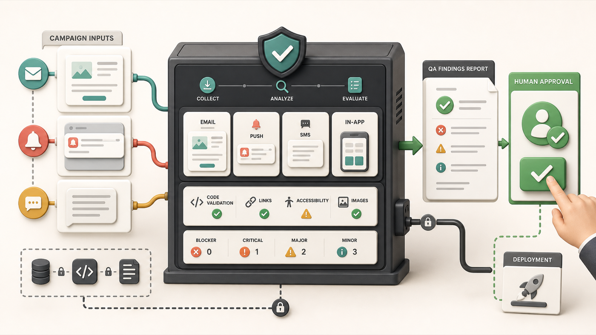

# OmniQA for Braze

OmniQA is a read-only pre-deployment QA workspace for Braze Campaigns and Canvases. It imports an approved asset, audits the message content and configuration exposed by Braze, supports focused copy and technical review, and records a named human readiness decision. It does not activate, schedule, or modify Braze assets.

## System Architecture & Data Flow



### Component Breakdown & Data Flow

1. **Read-only intake:** `/api/braze-import` accepts a Campaign or Canvas URL/API identifier and calls only the matching Braze details endpoint with a server-side key.
2. **Asset normalization:** Campaign messages and Canvas steps are converted into one internal model containing the available steps, message variants, channels, content, and status metadata.
3. **Automated QA:** Deterministic browser-side validators check required content, Liquid pairing, links, UTMs, images, accessibility signals, channel lengths, duplicate content, conversion metadata, and draft safety.
4. **Focused QA Review:** A reviewer can open one imported email, push, SMS, or IAM message for deeper copy and technical inspection, including Liquid, links, UTMs, images and alt text, contrast, spam signals, optional Figma comparison, and AI-assisted recommendations.
5. **Pre-Approval Checklist:** An editable checkpoint workspace captures campaign context, manual business checks, comments, owners, and exceptions. Users can add or remove checkpoints.
6. **Human Approval:** The Approval tab requires completed pre-approval checks plus audience, content, personalization, and test-evidence confirmations. Blockers prevent readiness approval, and the reviewer name, note, and timestamp are stored locally.
7. **Reporting and safety:** OmniQA prepares an email summary and browser print/PDF report. Deployment remains a separate human action in Braze; there is no write-back route.

## Key Features

### Automated QA

- Imports a Braze Campaign or Canvas by URL or API identifier.
- Supports the available post-launch draft when requested.
- Displays the step names, message variants, channels, and finding counts returned by the selected Braze details endpoint. A real read-only key replaces the fictional demo list with available data from that Campaign or Canvas.
- Produces severity-ranked findings with evidence and a required action.
- Includes a clearly labeled fictional browser demo when credentials are unavailable.

### QA Review

- Opens any imported message in focused copy or technical review.
- Supports email HTML, push, SMS, and IAM fields.
- Consolidates copy mismatch, Liquid, links, placeholders, UTM parameters, image sources and alt text, contrast, spam signals, and message-length checks.
- Optionally compares approved Figma text layers with message content.
- Keeps AI recommendations assistive; automated findings and reviewer decisions remain visible separately.

### Pre-Approval, Approval, and Reporting

- Provides editable campaign context, add/remove checkpoints, completion status, checkpoint comments, and general reviewer notes.
- Keeps final readiness approval in the QA Review area, separate from Automated QA.
- Prevents approval while blocker findings remain or pre-approval checkpoints are incomplete.
- Records reviewer confirmations, name, decision note, and timestamp in local browser storage.
- Creates a prefilled email report and a print/PDF-ready review summary.
- Never activates, schedules, or edits a Braze asset.

### Library and Settings

- Saves reusable fictional or user-created campaign examples locally for repeat review.
- Provides Braze dashboard links for stored campaign identifiers.
- Reports the availability of the read-only Braze, Gemini, and optional Figma server routes.

## Tech Stack & Design

- **Frontend:** React 18, Vite, JavaScript, and responsive CSS.
- **Server:** Vercel Serverless Functions for Braze details import, Gemini requests, Figma layer extraction, and health checks.
- **Editing and validation:** Monaco Editor plus local Liquid, link, image, UTM, and contrast utilities.
- **Security:** Secrets remain server-side. The Braze key is intended to have only `campaigns.details` and `canvas.details` permissions.
- **State:** Current work, editable pre-approval checkpoints, reviewer notes, fictional Library examples, and approval history are stored in the browser. Server-side audit history and SSO are not yet implemented.
- **Interface:** Compact responsive workspace with separate Automated QA and QA Review responsibilities.

## Quick Start

```bash
npm install
npm run dev
```

The app starts in **Sandbox Demo** mode. The demo is fictional data stored in the application and makes no external Braze request.

## Live Production Configuration

Add these Vercel environment variables, then redeploy:

- `BRAZE_REST_API_KEY` - required for read-only Braze import; limit it to `campaigns.details` and `canvas.details`.
- `BRAZE_REST_ENDPOINT` - the approved Braze REST base URL for the workspace.
- `GEMINI_API_KEY` - required for live AI-assisted copy and deliverability analysis.
- `GEMINI_MODEL` - optional; defaults to `gemini-1.5-flash`.
- `FIGMA_ACCESS_TOKEN` - optional; needed only for live Figma text extraction.

After deployment:

1. Open **Settings** and disable Sandbox Simulation.
2. Run the diagnostics handshake.
3. Open **Automated QA** and import an approved Campaign or Canvas.
4. Review automated findings and open individual messages in **QA Review**.
5. Complete editable manual checkpoints in **QA Review → Pre-Approval**.
6. Complete the final readiness decision in **QA Review → Approval**.

## Current Boundaries

- Braze details exports do not expose every dashboard targeting rule, so audience, exclusion, timing, and test-send verification remain required human checks.
- Email/PDF reports are generated client-side and are not stored on a server.
- Organization authentication, SSO, role-based access, and shared server-side audit history are future production work.
