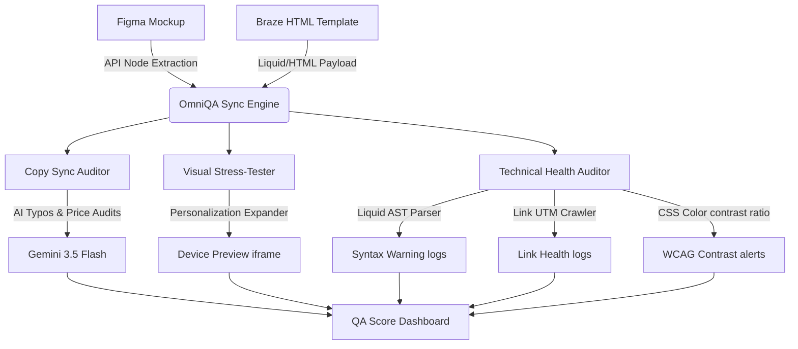

# OmniQA for Braze 🍦

OmniQA is a unified, real-time diagnostic dashboard designed for CRM engineering, campaign managers, and marketing developers. It automates campaign quality assurance by validating coding structures, verifying design compliance, and predicting deliverability health before you hit "Send" in Braze.

---

## 🛠️ System Architecture & Data Flow



---

## 🚀 Key Features

### 1. Copy Sync Auditor
*   **Figma Layer Cross-Checking**: Compares text nodes extracted from Figma design layout directly with Braze HTML code and Subject Line.
*   **AI Discrepancy Spotter**: Flags subtle price differences (e.g., "$10 off" vs. "10% off"), terms & conditions variances, and layout mismatches using `gemini-3.5-flash`.

### 2. Visual Stress-Tester
*   **Segment Simulation**: Renders templates in a real-time mobile preview frame under multiple subscriber profiles.
*   **Name & Custom Attributes**: Test how the layout handles extreme name lengths (e.g., *Hubert Wolfeschlegelsteinhausenbergerdorff*), missing fallback defaults, or conditional logic branches.

### 3. Technical Health Auditor
*   **Liquid Validator**: Scans curly braces `{{"..."}}` and logic blocks `` for nesting depth errors, preventing execution errors.
*   **UTM Parameter Crawler**: Automatically parses links in HTML to verify they are live, do not point to placeholders, and contain tracking tags.
*   **WCAG Contrast Checker**: Calculates text-to-background contrast ratios for custom button templates to ensure accessibility compliance.
*   **Spam Deliverability Advisor**: Uses generative heuristics to flag spam-trigger words and analyze image-to-text balance.

---

## 💻 Tech Stack & Design

*   **Core**: React, Vite, and CSS variables.
*   **Theme**: Premium dark cyber-navy palette with glassmorphism overlays and glowing circular gauge metrics.
*   **Typography**: Outfitted with *Outfit* for modern SaaS headers and *JetBrains Mono* for responsive code blocks.

---

## ⚙️ Quick Start & Installation

### Local Sandbox Run (Offline Simulator)
By default, the app initializes in **Sandbox Demo mode**. This allows you to explore the dashboard immediately using high-fidelity test campaigns and simulated responses without setting up API keys.

1.  Navigate to the directory:
    ```bash
    cd omni-qa-braze
    ```
2.  Install dependencies:
    ```bash
    npm install
    ```
3.  Launch the local dev environment:
    ```bash
    npm run dev
    ```
4.  Open `http://localhost:5176` (or the port Vite allocates) in your browser.

### Live Production Configuration
To link your real environment:
1.  Go to the **Settings** panel in the sidebar.
2.  Toggle off **Use Sandbox Simulation / Demo Mode**.
3.  Add your credentials:
    *   **Gemini API Key** (for active copywriting checks).
    *   **Figma Personal Access Token** and **File ID**.
    *   **Braze REST Endpoint** and **API Key**.
4.  Click **Save Configuration** to sync instantly.
