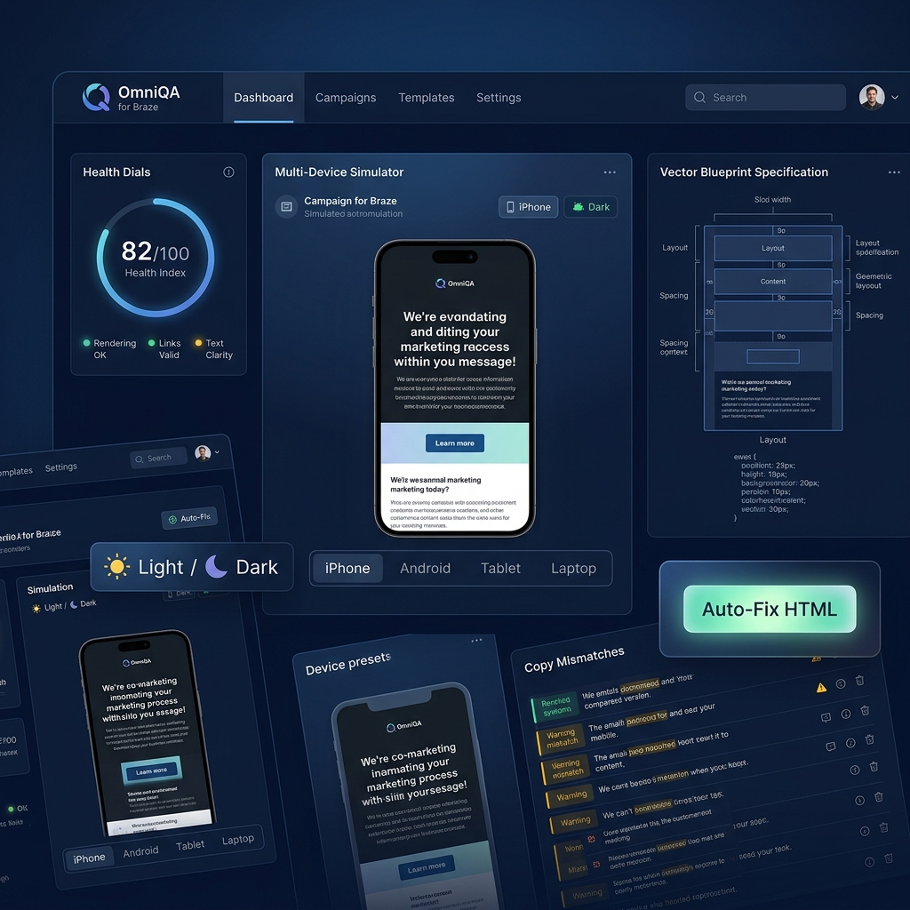

# OmniQA for Braze 🍦

OmniQA is a unified, real-time diagnostic dashboard designed for CRM engineering, campaign managers, and marketing developers. It automates campaign quality assurance by validating coding structures, verifying design compliance, and predicting deliverability health before you hit "Send" in Braze.



---

## 🛠️ System Architecture & Data Flow

```mermaid
flowchart TD
    %% Styling Definitions
    classDef source fill:#1e293b,stroke:#475569,stroke-width:2px,color:#f8fafc;
    classDef core fill:#0f172a,stroke:#38bdf8,stroke-width:2px,color:#f8fafc;
    classDef validator fill:#1e1b4b,stroke:#818cf8,stroke-width:2px,color:#f8fafc;
    classDef server fill:#311042,stroke:#c084fc,stroke-width:2px,color:#f8fafc;
    classDef output fill:#061712,stroke:#34d399,stroke-width:2px,color:#f8fafc;

    %% Nodes
    Figma["🎨 Figma File ID / URL"]:::source
    Payload["✉️ Coded Campaign HTML/CSS"]:::source
    Catalog["🗂️ Campaign Catalog Workspace"]:::source
    
    App["📊 OmniQA Diagnostics Console"]:::core
    
    subgraph LocalValidators ["🛡️ LOCAL CODE VALIDATORS"]
        Liquid["🧠 AST-less Liquid Parser"]
        Links["🔗 Link & UTM Crawler"]
        WCAG["👁️ WCAG Contrast Checker"]
    end
    class LocalValidators,Liquid,Links,WCAG validator;
    
    subgraph ServerRoutes ["🔐 VERCEL SERVERLESS API ROUTES"]
        GeminiRoute["/api/gemini"]
        FigmaRoute["/api/figma-layers"]
        HealthRoute["/api/health"]
    end
    class ServerRoutes,GeminiRoute,FigmaRoute,HealthRoute server;
    
    PDFExport["📄 Visual QA PDF Scorecard"]:::output
    ReportEmail["📧 HTML Diagnostics Report Email"]:::output
    AutoFix["🪄 One-Click HTML Auto-Fixer"]:::output
    BrazeLinks["🔥 Braze Dashboard Deep Links"]:::output
    
    %% Flow Connections
    Figma -->|File reference| App
    Payload -->|Import Code| App
    Catalog -->|Load Draft| App
    
    App <-->|Syntax Auditing| Liquid
    App <-->|Link Verification| Links
    App <-->|A11y Validation| WCAG
    
    App <-->|AI copy, spam & forecast requests| GeminiRoute
    App <-->|Text layer extraction| FigmaRoute
    App <-->|Environment readiness| HealthRoute
    
    App -->|Generate Scorecard| PDFExport
    App -->|Generate Email| ReportEmail
    App -->|Trigger Repair| AutoFix
    Catalog -->|Open campaign workspace| BrazeLinks
```



### Component Breakdown & Data Flow
1.  **Input Sources**: Campaign contexts come from pasted/imported HTML, campaign catalog entries, and Figma file IDs or URLs.
2.  **OmniQA Core Controller (`App.jsx`)**: Orchestrates data state and passes values to dedicated dashboard, preview, validator, and reporting views.
3.  **Local Validators**: Processes Liquid syntax, URL/UTM patterns, contrast checks, image risks, and preview states locally for instant feedback.
4.  **Secure Server Routes**: Calls `/api/gemini`, `/api/figma-layers`, and `/api/health` so Gemini and Figma secrets stay in Vercel environment variables instead of browser storage.
5.  **Output Layer**: Supports launch-readiness summaries, print/PDF reports, HTML repair helpers, and Braze dashboard deep links. Braze REST write-back is reserved for a later production phase.

---

## 🚀 Key Features

### 1. Unified Master Diagnostics & Copy Sync
*   **Figma Layer Cross-Checking**: Compares text nodes extracted from Figma designs directly with Braze HTML templates and subject lines.
*   **Fuzzy Text-Diff Matcher**: Dynamically tokenizes and scans plain text inside HTML tags to match lines of Figma design copy on the fly.
*   **Monaco HTML Code Editor**: Embeds a rich, syntax-highlighted editor with line numbers, code folding, word wrap, and automatic layout resizing that compiles state changes in real time.
*   **Master Diagnostics Hub**: Consolidates all Figma copy discrepancies, WCAG contrast alerts, UTM link crawler checks, Liquid logic errors, and spam triggers under a unified tabbed filter bar with live numeric counter badges.

### 2. Multi-Device & Multi-Channel Visual Stress-Tester
*   **Interactive Liquid Overrides**: Scans and detects dynamic Liquid template variables (`{{ user.first_name }}`, `{{ tier }}`) and renders text inputs for real-time customer profile updates.
*   **Custom Dynamic Variables (`+` / `×`)**: Allows developers to manually define, add (`+`), or delete (`×`) custom key-value variables to test edge cases outside default database parameters.
*   **Unified Multi-Tab Previews**: Allows campaign managers to instantly toggle the preview pane between:
    *   `📱 Device Simulator`: Renders simulated device frames (iPhone, Android, Tablet, Laptop) across channels.
    *   `📥 Client Inbox Previews`: Simulates subject line rendering and truncation lengths across Gmail Desktop, Apple Mail iOS, and Outlook Web.
    *   `📐 Figma Specification`: Displays Figma outline SVG blueprints side-by-side with code.
*   **Simulated Push Notifications**: Toggles between **Locked Phone (Full Screen)** (displays lockscreen wallpaper, clock/calendar overlay, and rich push notification cards containing the Blizzard campaign banner image) and **Unlocked Phone (App Banner)** (overlays a floating push banner over an active app grid home screen). Laptop preview is automatically hidden in push mode.
*   **In-App Message (IAM) Layout Simulator**: Renders center modals, slide-up banners, and full-screen takeovers directly inside the simulated device with editable headers, body text, dynamic action buttons, and redirect link validators.
*   **SMS Preview & Billing Segment Auditor**: Renders message bubbles in a text chat interface, scans for non-GSM-7 unicode inputs (emojis or smart quotes), calculates text lengths, and warns developers when copy exceeds character limits and triggers multi-segment billing costs.
*   **Email Client Dark Mode Inversion**: Injects dynamic overrides into the email iframe context to invert styles, guaranteeing text legibility in simulated dark mobile environments.

### 3. Technical Health & Reporting Engine
*   **Liquid Logic Delimiter Checker**: Scans logic control flows (`` and `{{ ... }}`) for nesting depth errors, missing delimiters, or orphaned statements.
*   **UTM Link Crawler**: Crawls all anchor links to detect dead hrefs, placeholder domains, and missing marketing UTM analytics keys.
*   **HTML Contrast Auto-Fixer**: Features a one-click repair engine that automatically adjusts violating button contrasts, resolves empty placeholder links, and appends missing UTM trackers.
*   **Staging PDF & Email Dispatcher**: Dispatches live email report drafts with detailed bulleted campaign issues lists and exports print-ready visual QA scorecards.

### 4. A/B Copy Compare & Predictive CTR Engine
*   **Standalone Side-by-Side Evaluator**: Compares subject lines, body copy snippets, CTA button texts, and CTA links for two variants (Baseline vs Challenger) in a dedicated tab.
*   **Local AI Predictive Model**: Predicts open rates, click-through rates (CTR), and overall grades based on character lengths, emojis, capitalization rules, urgency triggers, CTA verbs, and UTM configurations.
*   **Active Workspace Application**: Automatically updates the active workspace campaign (including direct parsing and updating of your template's HTML anchor elements) with your winning variant parameters.

### 5. Braze Campaign Catalog & Workspace Manager
*   **Dynamic Campaign Catalog**: Tracks campaign drafts, versions, status, and synchronization state.
*   **Cluster-Mapped Workspace Links**: Maps REST API endpoints (e.g. `rest.iad-01`, `rest.iad-03`, `rest.eu`) to direct, clickable URLs pointing straight to your campaign configuration inside the Braze dashboard console.

---

## 💻 Tech Stack & Design

*   **Core**: React, Vite, and CSS variables.
*   **Theme**: Premium dark cyber-navy palette with glassmorphism overlays and glowing circular gauge metrics.
*   **Typography**: Outfitted with *Outfit* for modern SaaS headers and *JetBrains Mono* for responsive code blocks.

---

## ⚙️ Quick Start & Installation

### Local Sandbox Run (Offline Simulator)
By default, the app initializes in **Sandbox Demo mode**. This allows you to explore the dashboard immediately using high-fidelity test campaigns and simulated responses without setting up API keys.

1.  Navigate to the directory:
    ```bash
    cd omni-qa-braze
    ```
2.  Install dependencies:
    ```bash
    npm install
    ```
3.  Launch the local dev environment:
    ```bash
    npm run dev
    ```
4.  Open `http://localhost:5176` (or the port Vite allocates) in your browser.

### Live Production Configuration
OmniQA now supports a secure live-mode MVP through Vercel Serverless Functions. Browser users do **not** paste long-lived API secrets into the app; the frontend calls internal routes and the routes read environment variables on the server.

1.  In Vercel, add these environment variables:
    *   `GEMINI_API_KEY` - required for live AI copy, spam, and engagement audits.
    *   `FIGMA_ACCESS_TOKEN` - required for live Figma text-layer extraction.
    *   `GEMINI_MODEL` - optional, defaults to `gemini-1.5-flash`.
2.  Redeploy the project after saving environment variables.
3.  Go to the **Settings** panel in OmniQA.
4.  Toggle off **Use Sandbox Simulation / Demo Mode**.
5.  Add a Figma file ID or URL and save the configuration.
6.  Use **Run Diagnostics Handshake** to confirm the server routes are configured.

Live mode currently supports:
*   Server-side Gemini copy, deliverability, and engagement analysis through `/api/gemini`.
*   Server-side Figma text extraction through `/api/figma-layers`.
*   Local Liquid, link, image, UTM, and WCAG-style validators in the browser.
*   Braze dashboard deep-linking from the campaign catalog.

Reserved for a later production phase:
*   Braze REST read/write sync.
*   Authenticated user accounts and saved audit history.
*   Server-side PDF/report storage and email delivery.
